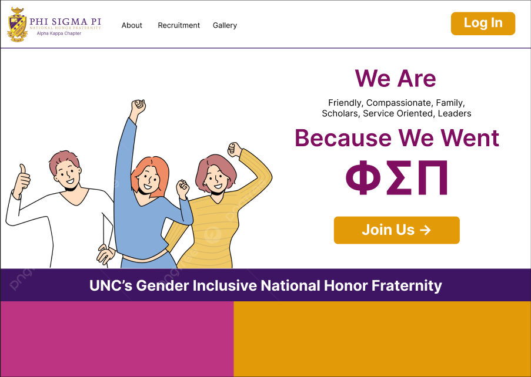
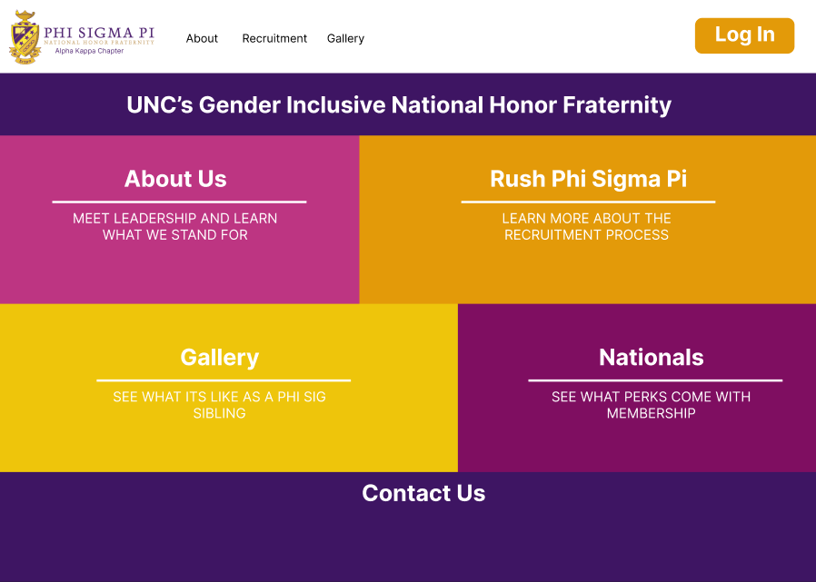
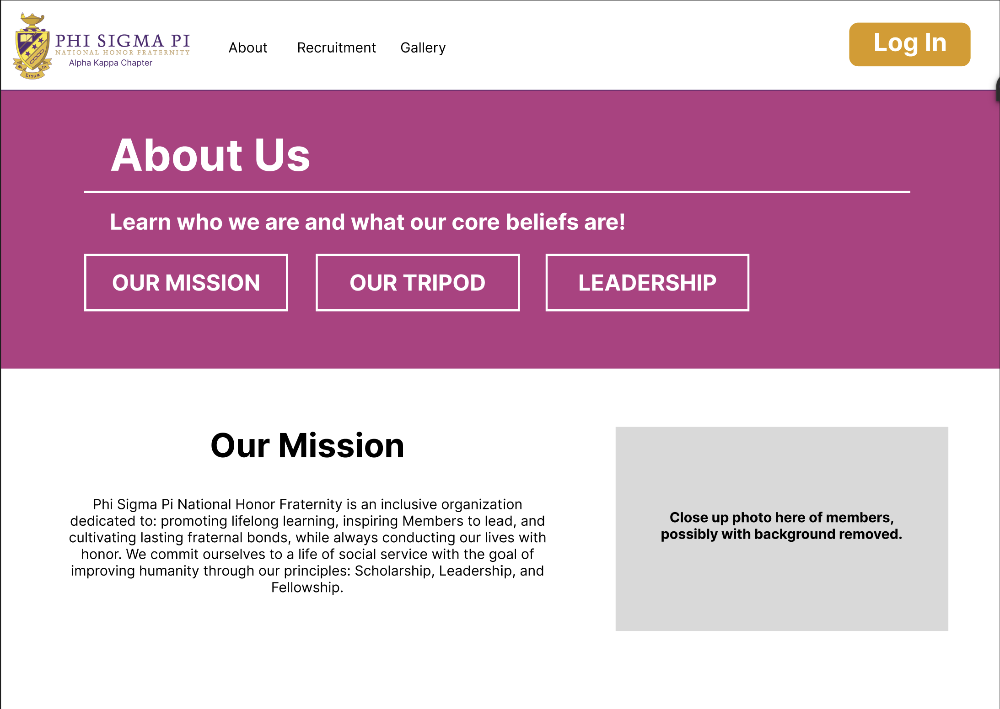
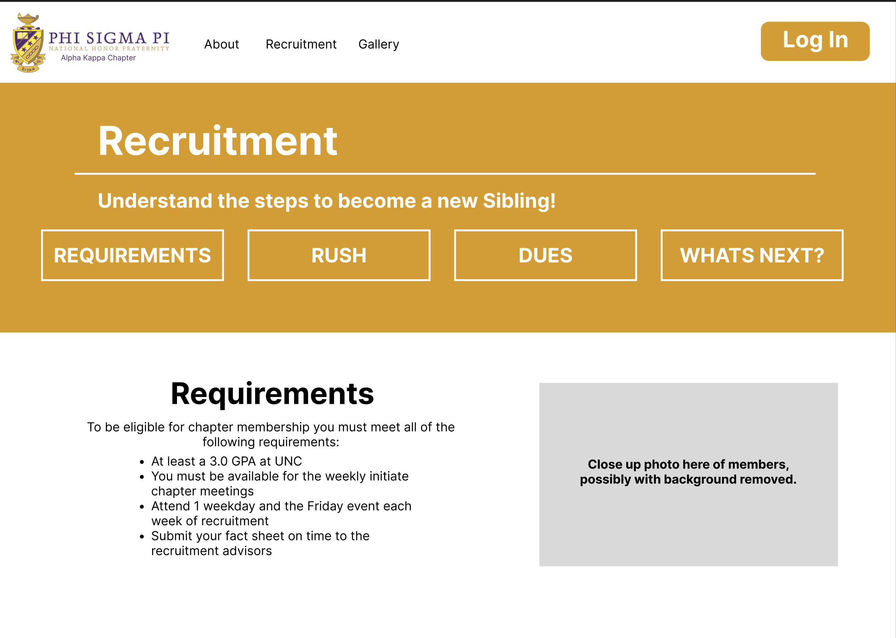
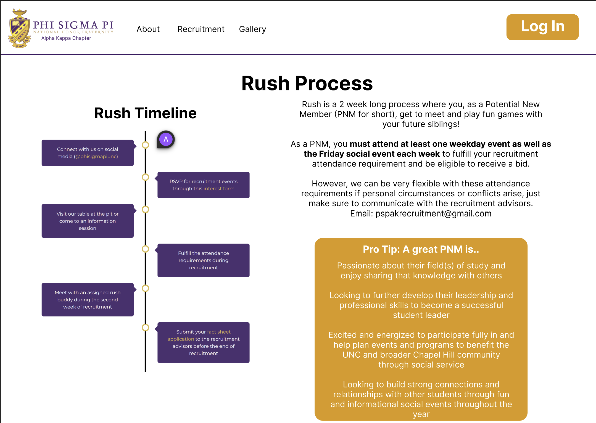
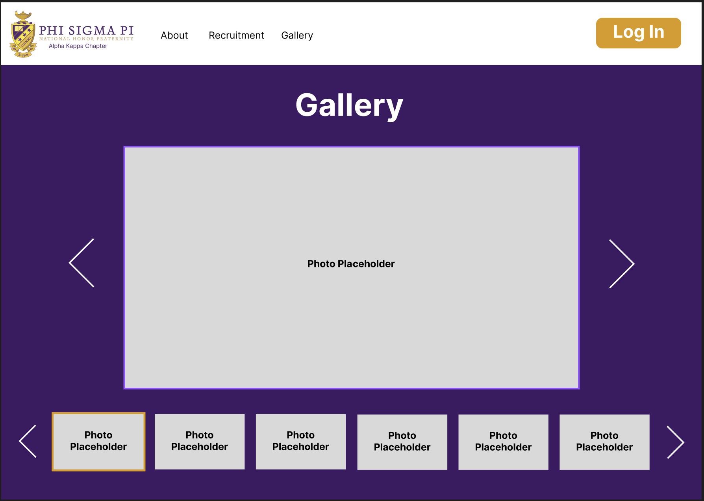
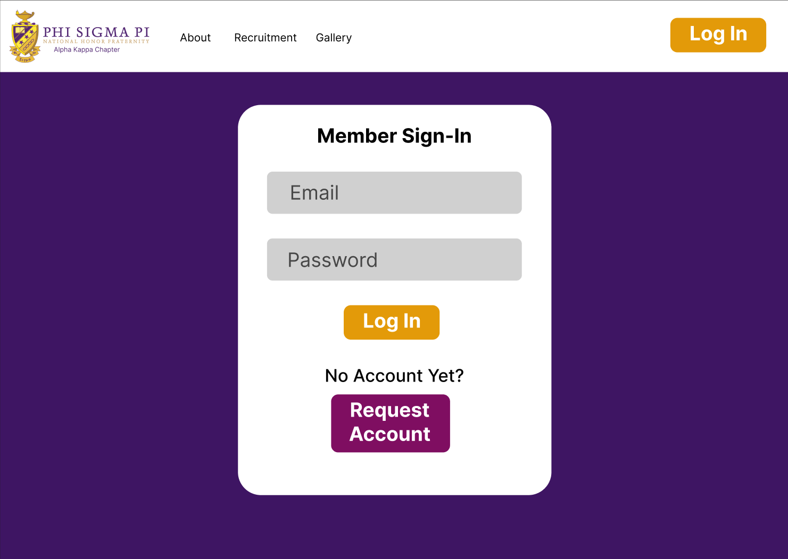
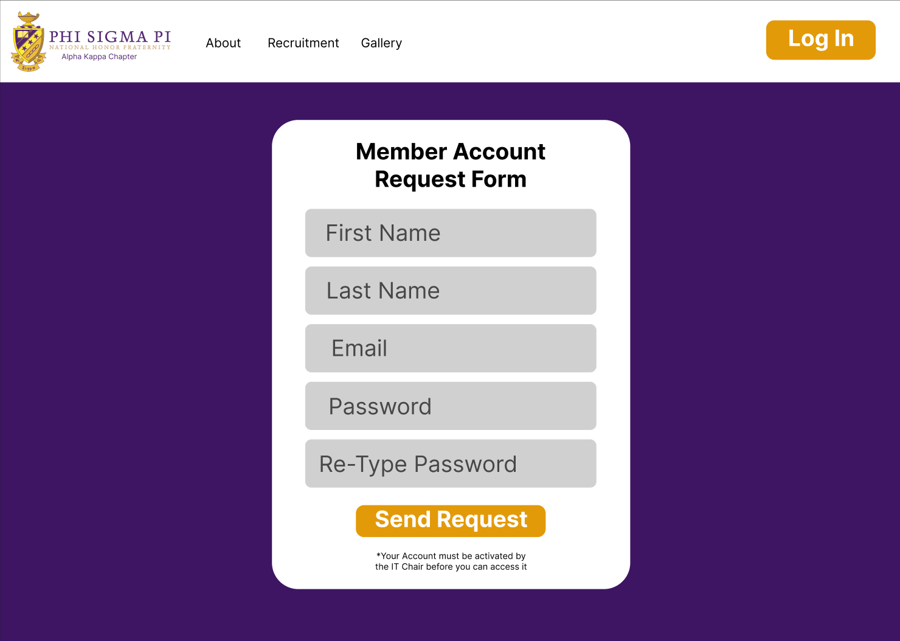
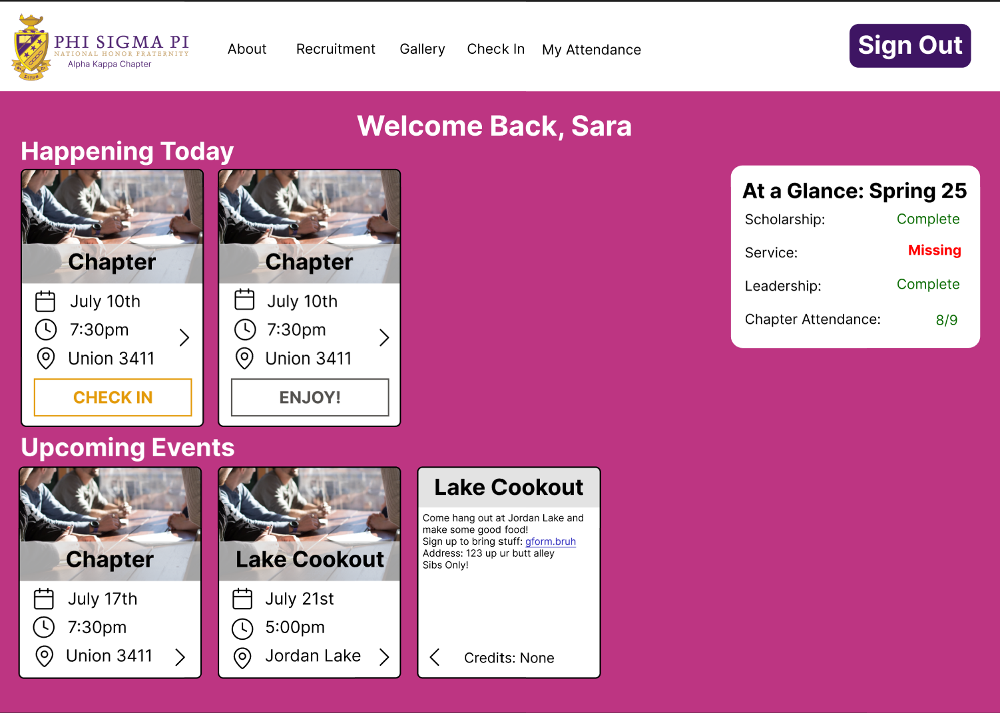
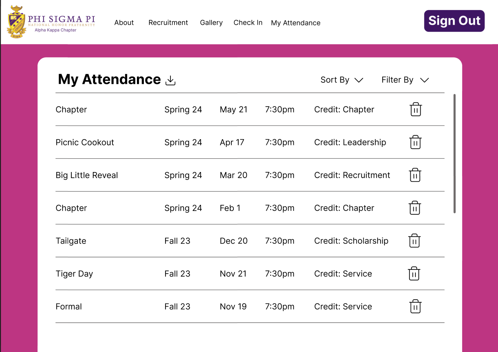

# Design Document: Phi Sigma Pi Forward Facing Website with Attendance Logger Component

## Overview

The website "phisigmapiunc.com" serves as the main forward facing website for the Alpha Kappa chapter of Phi Sigma Pi (PSP) at UNC. The website should inform potential new members (PNMs) about the values of PSP as well as the process to get involved. Further, the website should allow siblings to log in to view their standings within the chapter and log attendance to events.

## Key Personas

### Mary Maybe Member

- **Persona:** Unaffiliated but interested in Phi Sigma Pi
- **Minimum-Viable Feature:** View the static webpage for information about the fraternity and information on how to join.
- **Frequency/Importance of Use:** Infrequently and probably just a few times per person.

### Sara Sibling

- **Persona:** Sibling of Phi Sigma Pi
- **Minimum-Viable Feature:** Ability to log into the website and check into events.
- **Frequency/Importance of Use:** Regularly for event attendance and tracking requirements.

### Christian Chair

- **Persona:** Chair of Phi Sigma Pi events
- **Minimum-Viable Feature:** Ability to create events, download attendance lists, and view member attendance.
- **Frequency/Importance of Use:** Regularly for event management and attendance tracking.

### Anna Admin

- **Persona:** Admin of the Phi Sigma Pi chapter
- **Minimum-Viable Feature:** Ability to manage member roles and access permissions.
- **Frequency/Importance of Use:** Regularly for overall chapter management.

## User Stories

> Note: The Forward facing website will be similar to the current page, except with a design refresh

### Story A

As **Mary Maybe Member** I want to be greeted with a pleasing homepage upon fist loading the website.

- The homepage should provide highlights on the most important parts of PSP
- It should also provide direction on how to navigate the website (i.e. what information is where)
- The overall theme of the website should incorporate the colors of PSP
- Website navigation should be easily accessible at the top of the page
- Socials and other forms of contact should be included at the bottom of this page

### Story B

As **Any Persona** I want to navigate to `/recruitment` to see a description of the requirements PNMs need to know about the recruitment process. I also want to navigate to `/about` to learn more details about the chapter.

- The pages should include relevant graphics and charts such as rush process
- Content can come from the current recruitment and about page

### Story C

As **Any Persona** I want to navigate to `/gallery` to see a collection of images taken by the chapter.

- This needs to be fixed from the old website, as it was loading way too slow
- Possibly consider a swiping interface, or split images into pages of 100(?) to fix the slowness problem

### Story D

As **Sara Sibling, Christian Chair, and Anna Admin** I want to be able to log in using the login form, accessible at `/login`

- The login should be persistent for a month(?), to prevent users from needing to login every time
- Accounts should be able to be created using `/signup` with fields for email, name, password, etc.
  - Accounts should only be able to be logged into upon activation to prevent randoms from accessing the restricted portion of the website
  - Can also restrict accessing sensitive info to just chairs & exec or on a person to person basis

### Story E

As **Sara Sibling, Christian Chair, and Anna Admin** I want to be able to check into events to log my attendance by visiting `/checkin` and clicking the "Check-In" button on the appropriate event.

- Users should be redirected here after a valid login attempt
- Users with valid JWT tokens should also be redirected here upon navigating back to the webpage
- The "Check In" navigation tile should be shown and able to be clicked by these personas
- Current and upcoming events should be shown here
  - Only current events should have a visible "Check In" button
- The current credit fulfillment state for the user should be shown on this page

### Story F

As **Sara Sibling, Christian Chair, and Anna Admin** I want to be able to view all the records of attendance I have in the current and previous semesters.

- This page should be at `/attendance` and the nav tile "My Attendance" should be shown to these personas
- Data should be shown in a list/table like format
- Allow for deletion of each attendance record
- Data can be filtered or sorted
- Allow the list to be downloaded in a `.csv` format

### Story G

As **Christian Chair and Anna Admin** I want to be able to create new events and edit existing events for siblings to see and check into.

- The form for this should be at `/event/?` where "?" refers to the id of the event being edited (or 0 if creating a new event)
- The event should be created with a title, location, time, optional description, image, and credit it fulfills
- These personas should see a "Events" button on the nav bar which routes to `/events/`
  - List of the events that chair has created
  - *New Event* button
  - *Edit Event* and *Report* buttons on each event
  - **Chairs**: Only see their events
  - **Admins**: See all events

### Story H

#### P1
As **Christian Chair and Anna Admin** I want to be able to view attendance reports for all of my events.

- Event Attendance viewable on event edit page
  - List of attendees
- Each list should be exportable as a `.csv`

#### P2

See complete lists of siblings who have fulfilled my credit requirement, and those who have not.

- This page should be viewable at `/report` and by clicking on the "Report" button on the "Events" page
- List siblings who have & have not completed a selected credit
- All chairs and admins should have access to viewing all credit reports
- The credit reports should be exportable as a `.csv`

### Story I

As **Christian Chair and Anna Admin** I want to be able to edit the attendance list for my (chair) or all (admin) events.

- Able to navigate to `/report/<event_id>`
- See a delete button next to each name
- Able to select siblings from a dropdown to add to the attendance records

### Story J

As **Anna Admin** I want to be able to promote/demote others to Siblings, Chairs, and Admins. I also want to control who has access to view info of the chapter and it's siblings.

- Functionality stored at `/admin`
- Works much like the CSXL web application. Able to assign permission actions and resources to roles & assign roles to users
- For future: Able to control what user details each user is able to see

## Website Design

### Colors

The colors of the website should follow the PSP standard of purple, gold, and yellow.
Additional accent colors such as white and black can also be used.
Another idea would be to use pastel colors, which can be a little more inviting to the user: I think for this site, I could consider using some of the lighter shades to accomplish this.

A potential color pallet

### Design Concepts from other Websites

I like the landing portion of [this webpage](https://services.edutesla.com/).
Specifically, I like how the text is on a partially blurred background but is still easily read. I also like the nav bar at the top; however, it may be hard to implement something similar in this website due to the changing menu options based on login.
I am not a huge fan of having all of the information on one large page, since then the user has to scroll. If I were to do it, I would have each nav option point to another page. However, by doing it that way, I would need to come up with a new background for the nav that doesn't include the image.

On the [CS + SG Website](https://cssgunc.org/) I really like how the homepage is laid out. Having a simple call to action at the top, followed by clickable tiles underneath which detail all the different pages of the website. I also like the email form & contact information at the bottom of the page.
I don't like the color choices or the nav bar relying on clicking a "menu" button (however this may be more ideal on mobile devices, I should keep this in mind as most users for my website will be on their phones). I also don't like how the main photo on the front page is almost completely hidden behind the dark filtering color.

I really like this landing page. The nav bar is simple but effective, and the illustration is out of the way of the text but is still nice to have. I also like the change in color and cutoff of the illustration as the page transitions to more information.

## 🚦🚧🔶 Following Under Construction 🔶🚧🚦

## Wireframes

### External Homepage

This will be the screen that will show upon loading the website without a valid JWT token. The bar at the top will be the site wide navigation, with the logo routing to this page. The `Join Us` button will link to the `/recruitment` page. The colored squares at the bottom will match up with the below scrolled image. The image in the middle is a placeholder and will be replaced for an actual image of phi sig siblings. Finally, note that the logo in the top left corner will have the text "Alpha Kappa Chapter" edited in instead of placed there via the website.

Each square will route to its appropriate page. The squares will have a background image with the color being transparent in front until the user hovers over the square, in which case the color will fade away revealing the entire photo. Also the bottom will contain the contact information including email and socials.

### About Page

The about page will utilize the same photo below colored filter design element at the top (this time with no hover animation). The buttons on the header will link to appropriate sections on the webpage. On the actual webpage, the tripod and leadership sections will be on the lower portion of the website. For tripod, design on a three column view. For leadership, use the instagram photos (possibly transcribe onto page and just use the photo).

### Recruitment Page

This page will be very similar to the About page and the items detailed above.

This shows the lower portion of the recruitment page. There will be more sections below for the cost of the program as well as the "What's Next?" section.

### Gallery Page

The gallery will function much like other website galleries. The top will display a large photo with arrow buttons on either side to navigate photo by photo. The bottom row will allow for users to view multiple smaller photos at once, and select one to display in the top row. The one currently on display will have a gold border around it. The arrows on the bottom will navigate the bottom row left or right by a whole row.

### Login/Signup Page

Very Simple login page, clicking on "Request Account" should redirect user to `/signup`. After sending a successful login request, the user should be rerouted to the Check In page, and their login token should be maintained in the browser. Subsequent loads of the website should open in the Check In Page until the token expires.

Very simple design, upon submission a confirmation message should appear, nothing that no email will be sent on account activation.

### Check in Page

Cards with event details as added via Chairs on the event creation/edit page. Each event can be flipped over by clicking on the arrow to see more details on the back. If there are too many events to be viewed on one screen, include a scroll feature like on the gallery page. On scroll over for the check in button, have the white and gold switch.

### Personal Attendance Page

Page will show all the attendance records of the logged in user in a list format which can be filtered and sorted in any way the user would like. Default will be sorted by time in decreasing order top to bottom. User has option to delete attendance records - for case of checking into wrong event. Download icon for downloading as CSV.

### Event Creation/Edit Page

### Event Attendance/Credit Fulfillment Page

### Admin Page

## Possible Future Development

- Allow chairs to give credits without needing to create an event
- Announcement system
- Allow users to choose if their login is saved on the browser (check mark on login page)
- Filtering events based on user roles
- Profile editing page (likely to be implemented)
- Sibling Information Sheet

## Technical Implementation

Please consult the current IT chair for technical details regarding implementation, including technologies to be used, API routes, database concerns, and any other technical requirements.

The old website uses a React + Firebase tech stack. For the improved website, I will employ [`Next.js`](https://nextjs.org/) (React Framework) + Firebase for data storage. If backend service functions are required, I may look into serverless functions through google/firebase.

For CSS Styling, I will most likely use [`Tailwindcss`](https://tailwindcss.com/) as there is built in support in Next.

Consider building with some techniques outlined in [this repo](https://github.com/alan2207/bulletproof-react).
